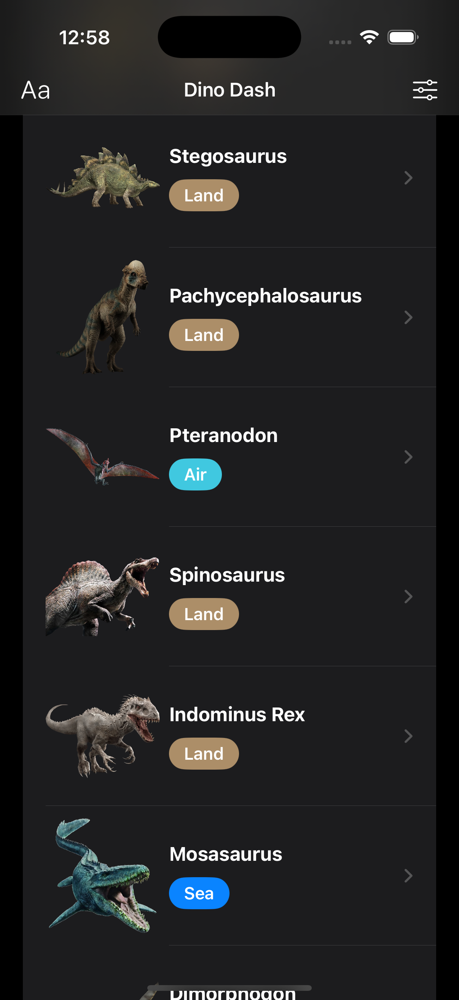
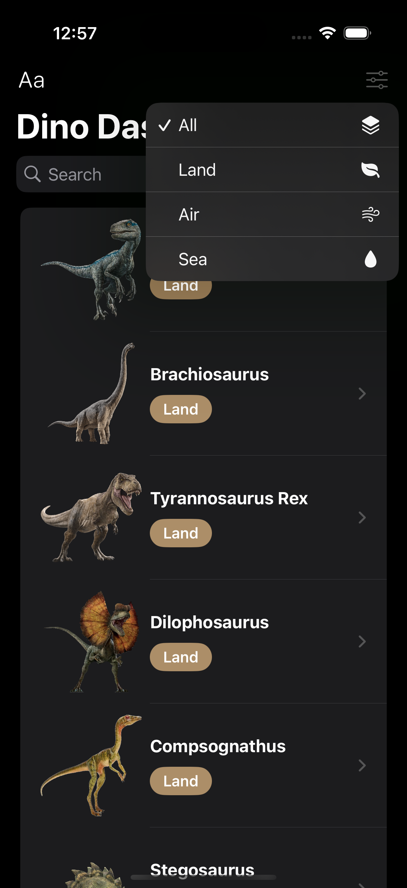
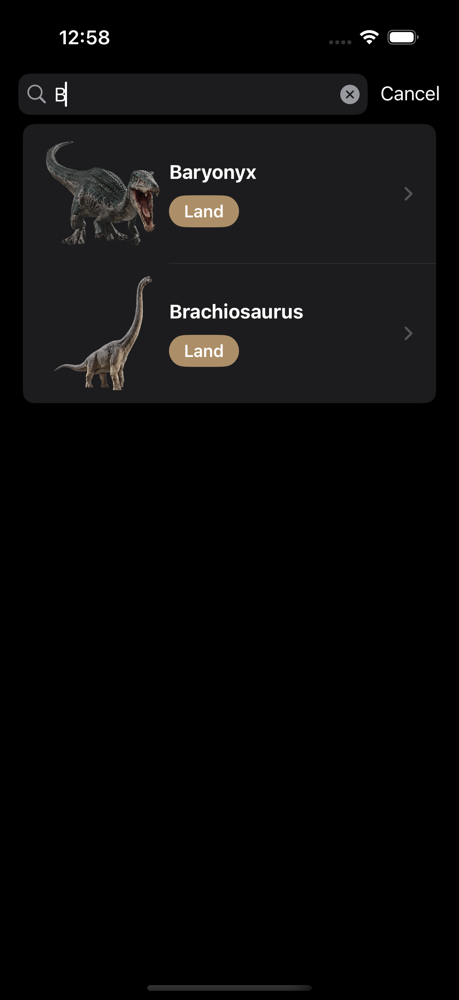
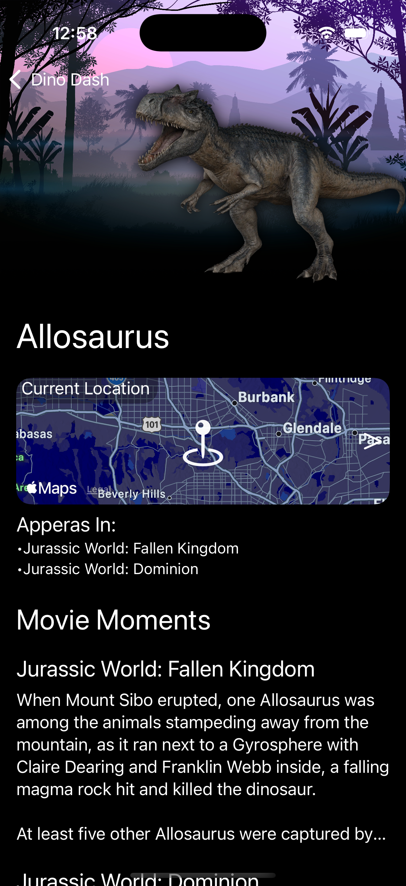
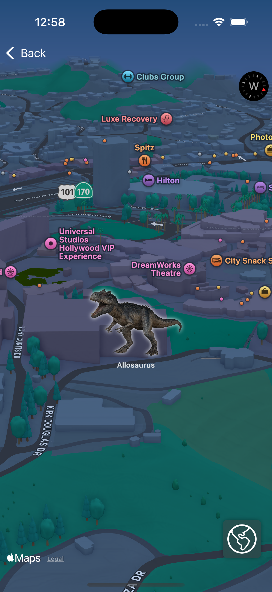

# DinoDash 

## Description
Welcome to the Dino Dash App for iPhone and iPad, where you can explore a curated list of the most awesome and feared apex predators from the Jurassic Park universe! This app is designed to provide an engaging and interactive experience while reinforcing key iOS development concepts.

## Features
- Dynamic List Management: Learn how to build and manage lists efficiently.
- Sorting & Filtering: Implement powerful sorting and filtering features for better user experience.
- Search Functionality: Enable users to quickly find their favorite Dino.
- Animations: Enhance the UI with smooth and engaging animations.
- MapKit Integration: Visualize dinosaur locations with Apple's MapKit.

## Technologies Used
- Swift (for app development)
- SwiftUI (for UI development)
- Xcode (as the primary IDE)
- MapKit (for geographical visualizations)

## Installation
Ensure you have Xcode installed on your Mac.

Clone the repository:

git clone https://github.com/Gurpreet0790/DinoDash.git

Open the project in Xcode and build the app.

Run the app on a simulator or a physical device.

